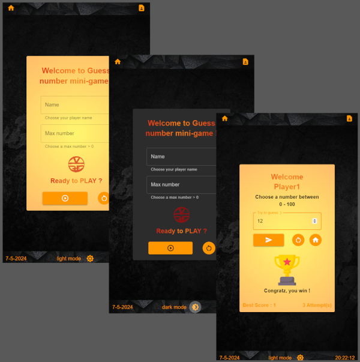

# Game-GuessNumberApp

A classic little coding game where you have to guess a secret number. Coding with love, React, MUI and fun while downloading the patch for my favorite game. And because my son ask me : 'are able to code a little guess number game, but not a ... Atari 2600 looks like ^^ ?'

# Technologies / features

"HTML, CSS, JavaScript, React, Redux, Sass, SPA, Saas, Vitejs, MUI, Dark mode, Theming"

# React + Vite

This template provides a minimal setup to get React working in Vite with HMR and some ESLint rules.

Currently, two official plugins are available:

- [@vitejs/plugin-react](https://github.com/vitejs/vite-plugin-react/blob/main/packages/plugin-react/README.md) uses [Babel](https://babeljs.io/) for Fast Refresh
- [@vitejs/plugin-react-swc](https://github.com/vitejs/vite-plugin-react-swc) uses [SWC](https://swc.rs/) for Fast Refresh
